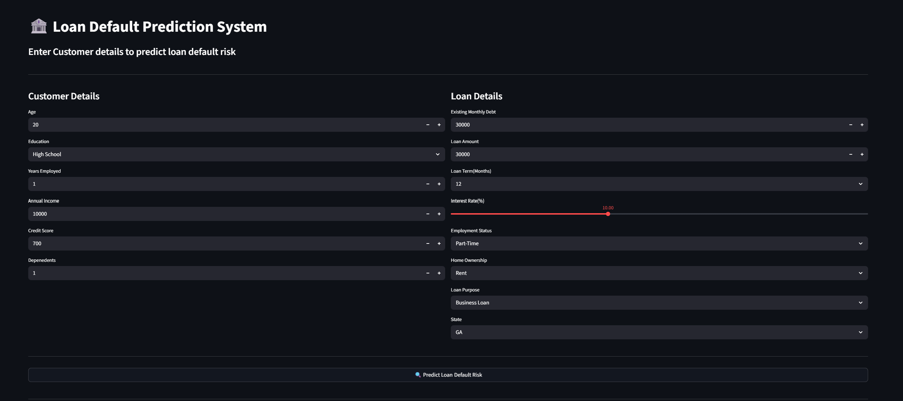
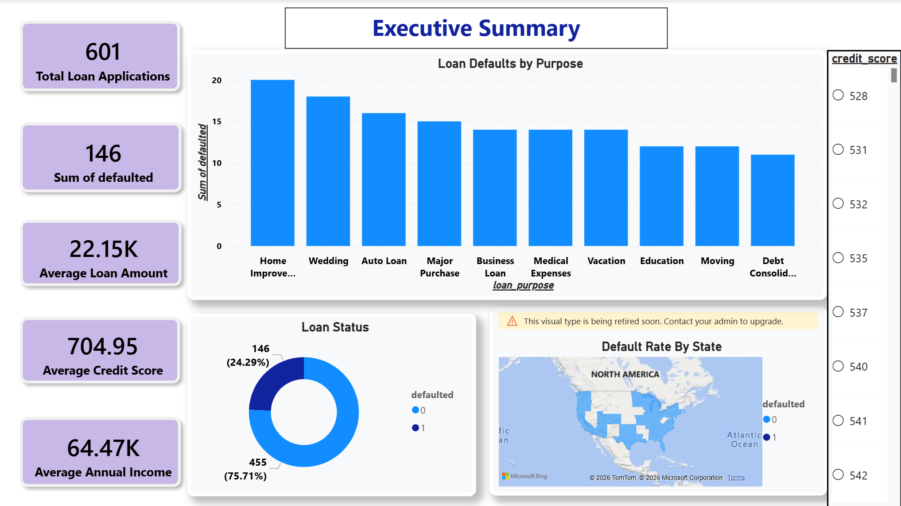
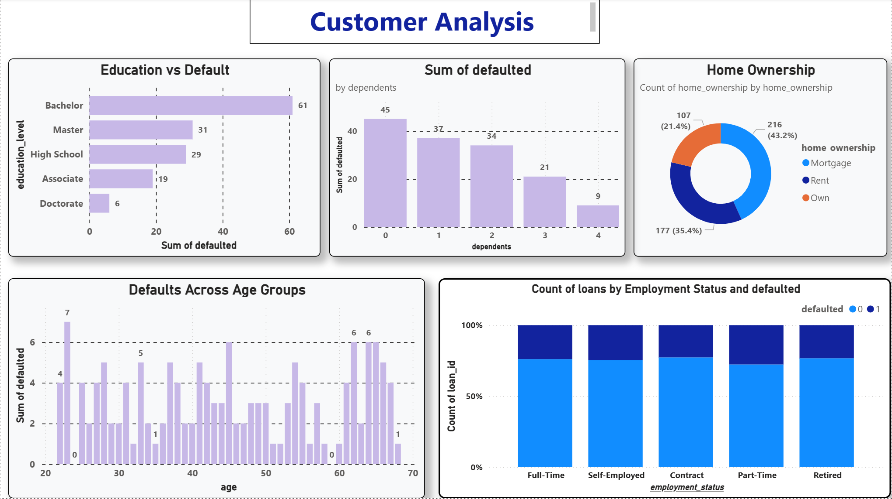
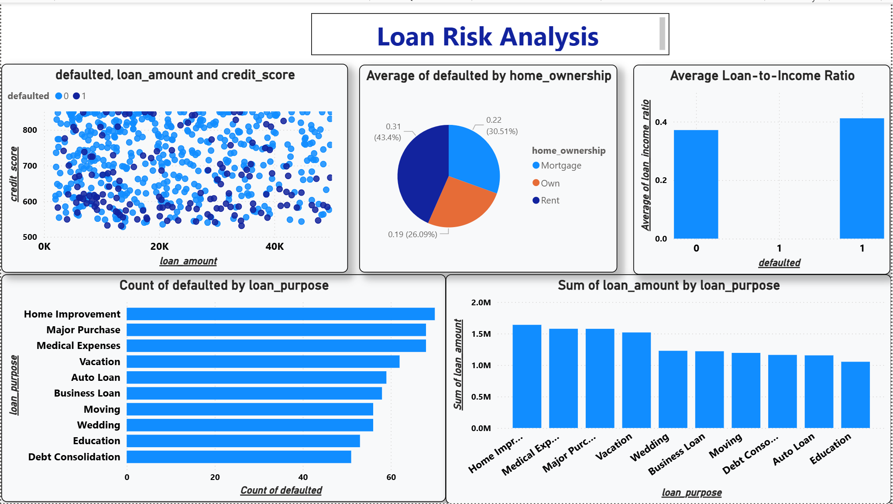
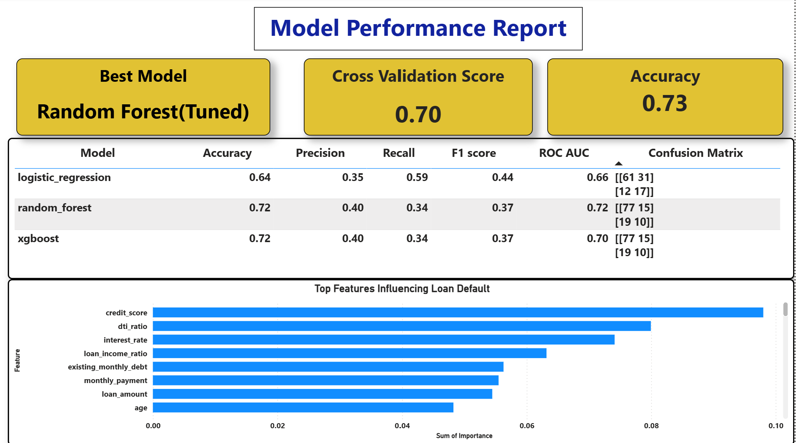

# 🏦 Loan Default Prediction System

[](https://adityanarayanchaubey-credit-risk-decision-support-sy-app-nkhykr.streamlit.app/)

### 🌐 Live Application
**Try the application here:**  
👉 https://adityanarayanchaubey-credit-risk-decision-support-sy-app-nkhykr.streamlit.app/

---
An end-to-end Machine Learning project that predicts the likelihood of a customer defaulting on a loan based on their financial and demographic information.

This project was built to understand the complete machine learning workflow—from collecting and cleaning data to feature engineering, model training, evaluation, business reporting with Power BI, and finally deploying the model as an interactive Streamlit web application.

The goal of this project is to demonstrate how machine learning can support data-driven loan approval decisions by estimating customer risk in real time.

---

## 🚀 Project Overview

Financial institutions receive thousands of loan applications every day. Approving loans without properly assessing customer risk can lead to significant financial losses.

In this project, a machine learning model is trained to predict whether a customer is likely to default on a loan using historical financial data.

The application allows users to enter customer information and instantly receive:

- Default Prediction
- Probability of Default
- Risk Category
- Loan Recommendation

---

## ✨ Features

- Interactive Streamlit web application
- Real-time loan default prediction
- Probability of default estimation
- Customer risk classification (Low, Medium, High)
- Loan recommendation based on predicted risk
- Power BI dashboard for business insights
- Modular and easy-to-maintain project structure

---

# 🛠️ Tech Stack

### Programming Language
- Python

### Machine Learning
- Scikit-learn
- XGBoost

### Data Processing
- Pandas
- NumPy

### Model Deployment
- Streamlit

### Data Visualization
- Power BI

### Model Serialization
- Joblib

---

# 📂 Project Structure

```text
Loan Default Risk Analysis/
│
├── app.py                     # Streamlit web application
├── predictor.py               # Loads trained model and performs predictions
├── utils.py                   # Prepares user input for prediction
├── requirements.txt
├── README.md
├── .gitignore
│
├── dashboard/
│   └── Loan Default Dashboard.pbix
│
├── data/
│   ├── raw/
│   └── processed/
│
├── models/
│   └── random_forest_tuned.pkl
│
├── notebooks/
│   ├── data_ingestion.ipynb
│   ├── Data_cleaning.ipynb
│   ├── Feature_engineering.ipynb
│   └── analysis.ipynb
│
├── reports/
│   ├── Dashboard.pdf
│   ├── feature_importance.csv
│   ├── model_comparison.csv
│   └── EDA charts (.png)
│
├── screenshots/
│   ├── streamlit_app.png
│   ├── executive_dashboard.png
│   ├── customer_analysis.png
│   ├── risk_analysis.png
│   └── model_performance.png
│
├── sql/
│   └── queries.sql
│
└── src/
    ├── loader.py
    ├── train.py
    ├── tune_model.py
    ├── evaluate.py
    ├── predict.py
    └── run_queries.py
```

---

# 📊 Machine Learning Workflow

The project follows a complete end-to-end machine learning pipeline:

- Data Ingestion
- Data Cleaning
- Exploratory Data Analysis (EDA)
- Feature Engineering
- SQL Analysis
- One-Hot Encoding
- Train-Test Split
- Model Training
  - Logistic Regression
  - Random Forest
  - XGBoost
- Hyperparameter Tuning using GridSearchCV
- Cross Validation
- Model Evaluation


---

# 🤖 Model Performance

Three machine learning models were trained and evaluated:

- Logistic Regression
- Random Forest
- XGBoost

After hyperparameter tuning, the **Random Forest Classifier** achieved the best overall performance and was selected for deployment.

### Best Model

**Random Forest Classifier**

**Cross Validation ROC-AUC:** **0.703**

The trained model is saved using Joblib and loaded by the Streamlit application for real-time predictions.

---

# 📈 Power BI Dashboard

A Power BI dashboard was developed to analyse customer behaviour and loan risk from a business perspective.

The dashboard consists of four pages:

- Executive Summary
- Customer Analysis
- Loan Risk Analysis
- Model Performance

---

# 💻 Streamlit Application

The deployed application enables users to:

- Enter customer information
- Predict loan default probability
- View customer risk category
- Receive a loan recommendation
- Understand the predicted risk through an intuitive interface

---

# 📸 Project Screenshots

## Streamlit Application



---

## Executive Dashboard



---

## Customer Analysis Dashboard



---

## Loan Risk Analysis



---

## Model Performance Dashboard



---

# ⚙️ Installation

### Clone the repository

```bash
git clone https://github.com/YOUR_USERNAME/Loan-Default-Prediction-System.git
```

### Move into the project directory

```bash
cd Loan-Default-Prediction-System
```

### Install dependencies

```bash
pip install -r requirements.txt
```

### Run the application

```bash
streamlit run app.py
```

---

# 🎯 Future Improvements

Some ideas for extending this project:

- Deploy the application 
- Add SHAP for model explainability
- Store prediction history in a database
- Build a REST API for predictions
- Add user authentication
- Experiment with advanced ensemble models
- Attach with cloud to provide streaming of data(to handle 10000 transactions per second)

---

# 👨‍💻 About Me

Hi, I'm **Aditya Narayan Chaubey**, a Computer Science undergraduate with a strong interest in Machine Learning, Data Analytics, and Artificial Intelligence.

I enjoy building end-to-end data science projects that combine technical implementation with real-world business problems. This project is one step in that journey, helping me strengthen my skills in data preprocessing, machine learning, dashboarding, and deployment.

If you have any suggestions or feedback, I'd be happy to connect!

**GitHub:** https://github.com/Adityanarayanchaubey

**LinkedIn:** www.linkedin.com/in/aditya-narayan-chaubey-857b9929a